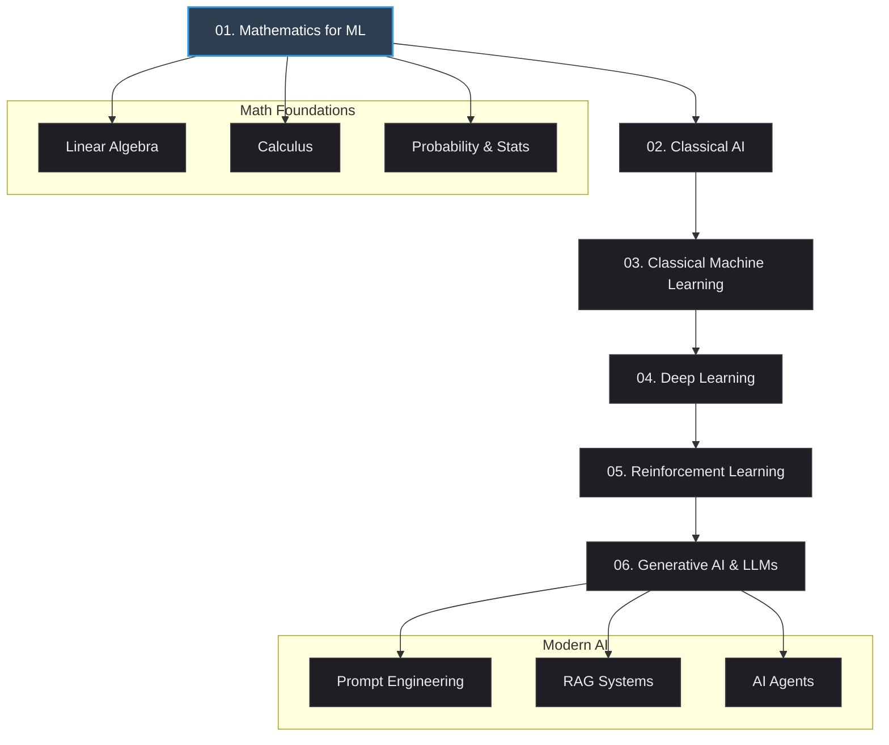

# Artificial Intelligence & Machine Learning Learning Repository

Welcome to the **AI & ML Learning Repository**! This is an open-source, interactive curriculum designed to take you from foundational mathematics to building advanced Machine Learning models, classical AI game engines, and modern Generative AI agents.

This repository uses **Jupyter Notebooks** to provide a hands-on, self-paced learning experience. Each notebook includes theoretical explanations, visual demonstrations, mathematical equations (using LaTeX), and practical exercises.

---

## 🗺️ Learning Roadmap

The curriculum is structured sequentially. We recommend following the path below:




---

## 📚 Curriculum Index

| Module | Topic | Notebooks / Guides | Core Concepts Covered |
| :--- | :--- | :--- | :--- |
| **01. Mathematics** | Foundational Math | 📐 [Linear Algebra](01_mathematics/01_linear_algebra.ipynb)<br>📈 [Calculus](01_mathematics/02_calculus.ipynb)<br>📊 [Probability & Stats](01_mathematics/03_probability_statistics.ipynb) | Vectors, Matrices, Eigenvalues, Gradient Descent, Prob distributions, Bayes' Theorem |
| **02. Classical AI** | Search & Games | 🔍 [Search Algorithms](02_classical_ai/01_search_algorithms.ipynb)<br>🎮 [Game Playing Minimax](02_classical_ai/02_game_playing_minimax.ipynb) | DFS, BFS, A* Search, Minimax, Alpha-Beta Pruning, Tic-Tac-Toe engine |
| **03. Classical ML** | Supervised & Unsupervised | 🧹 [Data Preprocessing](03_classical_ml/01_data_preprocessing.ipynb)<br>📉 [Regression](03_classical_ml/02_regression.ipynb)<br>🏷️ [Classification](03_classical_ml/03_classification.ipynb)<br>🧩 [Clustering](03_classical_ml/04_clustering.ipynb) | Feature Scaling, Linear/Polynomial Regression, Logistic Regression, Trees, SVMs, K-Means, PCA |
| **04. Deep Learning** | Neural Networks | 🔥 [PyTorch Basics](04_deep_learning/01_pytorch_basics.ipynb)<br>🧠 [Neural Networks](04_deep_learning/02_neural_networks.ipynb)<br>👁️ [Computer Vision](04_deep_learning/03_convolutional_neural_networks.ipynb) | Tensors, Autograd, Backpropagation, CNNs, Image Classification |
| **05. Reinforcement Learning** | Decision Processes | 🕹️ [Q-Learning](05_reinforcement_learning/01_q_learning.ipynb) | MDPs, Q-tables, Exploration vs. Exploitation, Gymnasium environments |
| **06. Generative AI** | LLMs & Agents | 📝 [Prompt Engineering](06_generative_ai_llms/01_prompt_engineering.md)<br>🗄️ [LLM APIs & RAG](06_generative_ai_llms/02_llm_apis_and_rag.ipynb)<br>🤖 [AI Agents Intro](06_generative_ai_llms/03_ai_agents_intro.ipynb) | Chain-of-Thought, System Prompting, Vector Embeddings, RAG, ReAct Agent loops |

---

## 🚀 Getting Started

To get started with this repository locally, follow these steps:

### 1. Prerequisites
Ensure you have **Python 3.8+** installed. We highly recommend using **Conda** or a python virtual environment.

### 2. Clone the Repository
```bash
git clone https://github.com/your-username/Ai-ML.git
cd Ai-ML
```

### 3. Installation
Create a virtual environment and install the required dependencies:

```bash
# Using python venv
python -m venv .venv
source .venv/bin/activate  # On Windows: .venv\Scripts\activate
pip install -r requirements.txt
```

For more detailed setup options, check the [Installation and Setup Guide](setup/installation.md).

### 4. Run the Jupyter Server
Launch the notebook environment:
```bash
jupyter notebook
```
This will open the dashboard in your web browser where you can click on any module directory and run the notebooks.

---

## 🤝 Contributing

We welcome contributions from the community! Check out our [Contributing Guidelines](CONTRIBUTING.md) to see how you can help improve this repository.

## 📄 License

This repository is licensed under the MIT License. See the [LICENSE](LICENSE) file for more information.
